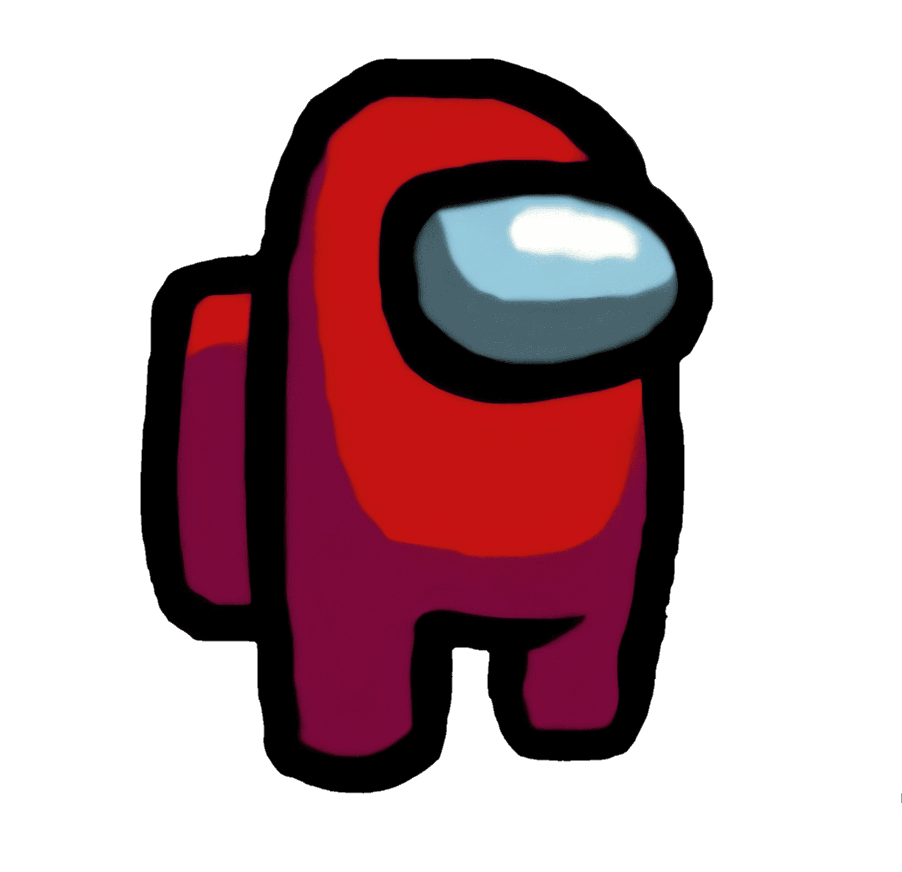

[]

Been an Electronics Engineering Tech for 15 years with 2 AAS one in Electronic Engineering and the other in Computer Engineering. In 2021 I Decided to move over to the software side. I started my journey by teaching myself Python. I'm also an avid outdoors guy that loves hiking and fishing, traveling, and meeting new people. I'm a retro game console and arcade lover. I spend some of my free time fixing and repairing them along with any other electronics I may find lying around. I also love using microcontroller in small projects to help make my life easier. 
